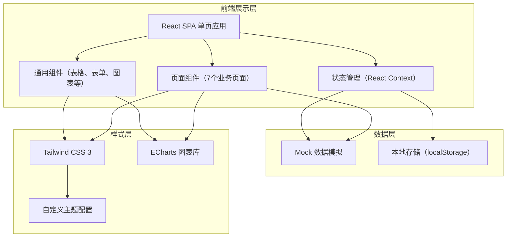

## 1. 架构设计

## 2. 技术描述
- **前端框架**：React@18 + TypeScript
- **构建工具**：Vite@5
- **样式框架**：Tailwind CSS@3
- **图表库**：ECharts@5
- **图标库**：Lucide React（线性风格图标）
- **路由**：React Router@6
- **状态管理**：React Context + Hooks
- **数据来源**：前端 Mock 数据，无需后端服务
- **初始化工具**：npm create vite@latest

## 3. 路由定义
| 路由 | 页面名称 | 说明 |
|------|---------|------|
| /admission | 人员收治 | 戒毒人员收治登记与入所体检评估 |
| /detoxification | 生理脱毒 | 生理脱毒治疗与尿检复吸筛查 |
| /psychological | 心理矫治 | 心理咨询矫治与心理评估 |
| /rehabilitation | 康复训练 | 康复体能训练与技能培训 |
| /management | 所内管理 | 分级管理、违规处理与亲情会见 |
| /education | 教育帮扶 | 思想教育与社会帮扶 |
| /release | 解除回归 | 期满解除与后续照管衔接 |
| / | 重定向至 /admission | 默认首页 |

## 4. 组件结构设计

### 4.1 布局组件
- `Layout.tsx` - 主布局（侧边导航 + 顶部栏 + 内容区）
- `Sidebar.tsx` - 左侧导航栏
- `Header.tsx` - 顶部信息栏
- `PageContainer.tsx` - 页面容器（带面包屑和标题）

### 4.2 通用组件
- `DataTable.tsx` - 数据表格组件
- `StatCard.tsx` - 统计卡片组件
- `StatusBadge.tsx` - 状态标签组件
- `Timeline.tsx` - 时间线组件
- `Modal.tsx` - 弹窗组件
- `FormField.tsx` - 表单字段组件
- `ChartCard.tsx` - 图表卡片容器
- `StepIndicator.tsx` - 步骤指示器

### 4.3 业务页面组件
- `admission/` - 人员收治模块
  - `AdmissionForm.tsx` - 收治登记表单
  - `HealthCheckup.tsx` - 入所体检评估
- `detoxification/` - 生理脱毒模块
  - `TreatmentRecord.tsx` - 脱毒治疗记录
  - `UrineTest.tsx` - 尿检筛查
- `psychological/` - 心理矫治模块
  - `CounselingRecord.tsx` - 心理咨询记录
  - `PsychAssessment.tsx` - 心理评估
- `rehabilitation/` - 康复训练模块
  - `PhysicalTraining.tsx` - 体能训练
  - `SkillTraining.tsx` - 技能培训
- `management/` - 所内管理模块
  - `LevelManagement.tsx` - 分级管理
  - `ViolationHandler.tsx` - 违规处理
  - `FamilyVisit.tsx` - 亲情会见
- `education/` - 教育帮扶模块
  - `IdeologyEducation.tsx` - 思想教育
  - `SocialSupport.tsx` - 社会帮扶
- `release/` - 解除回归模块
  - `ReleaseProcess.tsx` - 期满解除
  - `Aftercare.tsx` - 后续照管

## 5. 数据模型定义

### 5.1 核心数据结构

```mermaid
erDiagram
    DETAINEE ||--o{ HEALTH_CHECKUP : has
    DETAINEE ||--o{ TREATMENT : receives
    DETAINEE ||--o{ URINE_TEST : undergoes
    DETAINEE ||--o{ COUNSELING : attends
    DETAINEE ||--o{ PSYCH_ASSESSMENT : takes
    DETAINEE ||--o{ TRAINING_RECORD : participates
    DETAINEE ||--o{ LEVEL_CHANGE : has
    DETAINEE ||--o{ VIOLATION : commits
    DETAINEE ||--o{ VISIT : has
    DETAINEE ||--o{ EDUCATION : attends
    DETAINEE ||--o{ RELEASE : has
    DETAINEE {
        string id PK
        string name
        string idCard
        string gender
        date birthDate
        string ethnicity
        string education
        string address
        date admitDate
        int durationMonths
        string currentLevel
        string status
    }
    HEALTH_CHECKUP {
        string id PK
        string detaineeId FK
        date checkDate
        float height
        float weight
        string bloodPressure
        string heartRate
        string bloodType
        boolean infectiousDisease
        int dependenceLevel
        string notes
    }
    TREATMENT {
        string id PK
        string detaineeId FK
        date date
        string medication
        string dosage
        string vitalSigns
        int progress
        string doctor
        string notes
    }
    URINE_TEST {
        string id PK
        string detaineeId FK
        date testDate
        string testType
        string result
        string tester
        string notes
    }
    COUNSELING {
        string id PK
        string detaineeId FK
        date date
        string counselor
        string topic
        int duration
        string mood
        string summary
    }
    PSYCH_ASSESSMENT {
        string id PK
        string detaineeId FK
        date date
        string scale
        int score
        string riskLevel
        string conclusion
    }
    TRAINING_RECORD {
        string id PK
        string detaineeId FK
        date date
        string type
        string content
        int duration
        int performance
        string coach
    }
    LEVEL_CHANGE {
        string id PK
        string detaineeId FK
        date date
        string fromLevel
        string toLevel
        string reason
        string approver
    }
    VIOLATION {
        string id PK
        string detaineeId FK
        date date
        string type
        string description
        string evidence
        string punishment
        string status
    }
    VISIT {
        string id PK
        string detaineeId FK
        date date
        string visitor
        string relation
        string visitType
        int duration
        string notes
    }
    EDUCATION {
        string id PK
        string detaineeId FK
        date date
        string type
        string content
        int score
        string teacher
    }
    RELEASE {
        string id PK
        string detaineeId FK
        date releaseDate
        string assessmentResult
        string destination
        string contact
        string status
    }
```

### 5.2 Mock 数据组织
- `src/data/mock/` 目录存放所有模拟数据
- 每个业务模块一个数据文件：`detainees.ts`, `treatment.ts`, `counseling.ts` 等
- 统一导出在 `index.ts` 中
- 使用 Faker.js 风格手动生成真实感数据（无需外部依赖）
